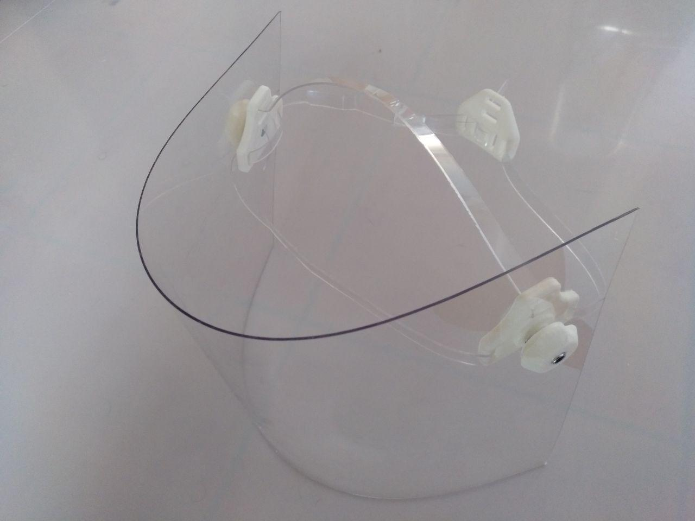

# RESUMEN
Visera/pantalla facial diseñada para ser construida con materiales caseros e impresión 3D.

# Materiales empleados
    - Lámina policarbonato de 1mm (por comprobar si 0.5mm funciona igual)
    - PLA impreso en 3D (por ahora se requieren algo menos de 2 horas de impresión para un kit)
    - 2 tornillos M5x30 (o hasta unos 45mm) de cabeza hexagonal
    - 2 tuercas M5
 
# STATUS
    - Buscando materiales alternativos para las tiras de sujección
    
# TODO
    - Documentar la construcción actual

# Log
    - movido a la descripción de los commit    

# Varios
    El diseño está realizado en FreeCAD
    Este trabajo está liberado bajo la licencia CC_BY_NC_SA.

# Imágenes

