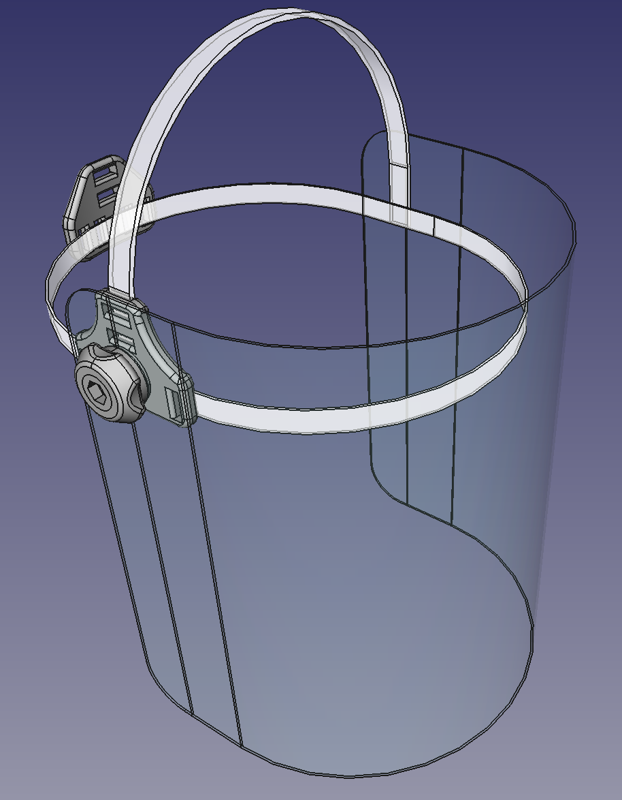

# RESUMEN
Visera/pantalla facial diseñada para ser construida con materiales caseros e impresión 3D.

# Materiales empleados
    - Lámina policarbonato de 1mm (por comprobar si 0.5mm funciona igual)
    - PLA impreso en 3D
    - 3 tornillos M5x30 (o hasta unos 45mm) de cabeza hexagonal
    - 3 tuercas M5
 
# STATUS
    - Validando ergonomía
    - Buscando materiales alternativos para las tiras de sujección
    
# TODO
    - Dar hergonomía al cierre trasero
    - Documentar la construcción actual

    
# Log
    19-Marzo 22:00 -> Reformadas todas las piezas. Creado cierre ajustable con rosca, reducido tamaño de tuercas y hebilla frontal. Construido prototipo físico versión 1
    18-Marzo 20:00 -> Limpieza del archivo freecad, reexportación de stls y primer prototipo físico construido.
    17-Marzo 22:00 -> Se actualiza modelo a correas de policarbonato de 1mmx10mm de ancho
    17-Marzo 18:00 -> Se comprueba mediante prueba de impresión validez de la aproximación al diseño con tiras de policarbonato
    17 Marzo inicio -> Concepto inicial, creación de repositorio y primer archivo con 3D parcial
    

# Varios
    El diseño está realizado en FreeCAD
    Este trabajo está liberado bajo la licencia CC_BY_NC_SA.

# Imágenes

